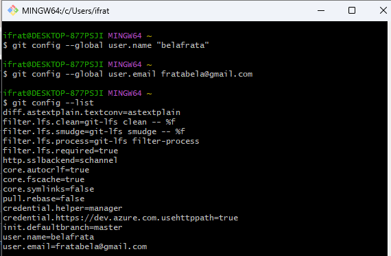

DUPLA: Isabela Frata Santos e Ana Beatriz de Sousa Silva

*No primeiro passo, use 'git config --global' para configurar o usuário*

*No segundo passo, use 'cd' para entrar na pasta do arquivo. 'git init' para inicializar o repositório. 'git status' para checar a situação do repositório e arquivos. 'git add .' para adicionar todas as modificações à linha do tempo do git (para serem commitadas)*

*No terceiro passo, use 'git commit -m' para commitar e adicionar uma mensagem ao commit. 'git log' para ver o histórico de commits. 'git remote add origin' para vincular seu repositório local com o repositório remoto. 'git branch -M main' para renomear a branch atual para main.*

*No quarto passo, use 'git pull --rebase origin main' para atualizar a branch atual com as mudanças do repositório remoto. 'git push -u origin main' para enviar a branch atual para o repositório remoto*
